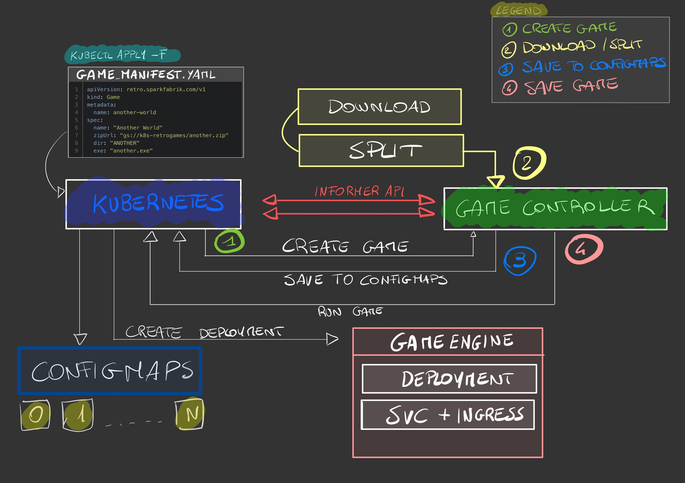

# AdditronK8S

## Description

AdditronK8S is a retro game machine build as a Kubernetes custom controller and
implemented in Javascript.

> The name `Additron` is a tribute to the great inventor and scientist [Josef Kates](https://en.wikipedia.org/wiki/Josef_Kates) who invented the [**first digital playing machine**](https://en.wikipedia.org/wiki/Bertie_the_Brain) to showcase his Additron tube invention.

I did this as a PoC [for a company talk](https://www2.slideshare.net/sparkfabrik/retro-gaming-machine-made-with-javascript-and-kubernetes-240654394) [(Video)](https://youtu.be/XlhSCWzgQ4k), to demonstrate how **powerful** can be the
**Kubernetes APIs** when used also to build custom applications.

I chose to use **Javascript** as it is an **officially supported client**
and also because I didn't find any project a bit more complex than a simple hello world, to implement a custom controller.

> Personal note: When developing for Kubernetes, you have to deal with tons of REST APIs and complex relationship between them, this is where the GO
ecosystem shines, you have framework and abstractions used to build Kubernetes
itself and you are sure to use top-notch quality code; so if you plan
to implement something serious with Kubernetes, my advice is to use GO as
a first class citizen language of your system.

One of the goal of this project was to use just **Kubernetes API without any external dependency** (neither the storage),
infact is noteworthy that `Configmaps` are (ab)used as a persistent storage layer, using a simple technique
of split/merge parts of files to save the games.

How it works (hand written schematic):




See it in action:

[](https://asciinema.org/a/yuUCC0i5BizfRPYoSBcGAP4Sc)

Here you can find the slides of my talk: https://www2.slideshare.net/sparkfabrik/retro-gaming-machine-made-with-javascript-and-kubernetes

## Technology

This project consists of 3 main components:

1. A Docker image to run games based on Dosbox + [noVNC + Pulseaudio/gStreamer](https://github.com/novnc/noVNC/issues/302)
2. A Javascript Kubernetes custom controller who implements the CRD and the needed logic to run the games.
3. A K3d Kubernetes cluster and Skaffold to manage it.

> WARNING: The code is not even close to be production ready, it is just a quick PoC to build a custom controller in Javascript.

## Quick start

### Controller

To run the controller it is just needed a working Docker environment.

Running `make` you will have end up with:

1. A k3d kubernetes cluster
2. Docker images loaded
3. Game controller deployed

### Games

Files can be downloaded from any public http endpoint or from any public GCP cloud storage bucket.

The expect manifest to run a game is this:

```yaml
apiVersion: retro.sparkfabrik.com/v1
kind: Game
metadata:
  name: game-name
spec:
  name: "Game name human friendly"
  zipUrl: "gs://my-gs-bucket/game.zip"
  dir: "GAME"
  exe: "GAME.EXE"
```

Where `dir` represent the directory of the unzipped game and `exe` the binary to run.

To be clear, this is a structure we expect:

```
unzip game.zip

> GAME
 - GAME.EXE
 - SOUND.MOD
 - VIDEO.MOD
```

Once you have the game up and running, you can access via the web browser by proxying
the game service, like this:

```
kubectl port-forward svc/game-name 8080:8080 8081:8081
```

Finally you can access the game console on: `https://localhost:8080`

At this stage you will be presented with the dosbox command line and
the command to run to execute the game.

> *IMPORTANT*: To start the audio websocket, before to start the game and inside the
> dosbox cli, you have to press `ALT + s` this will start once the needed websocket,
> to transport the audio from the pulseaudio server to your browser.

